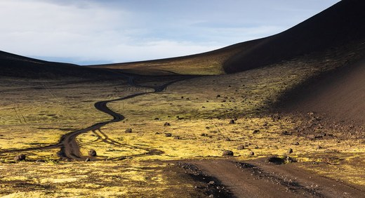
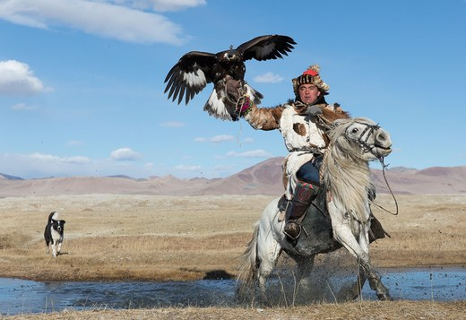
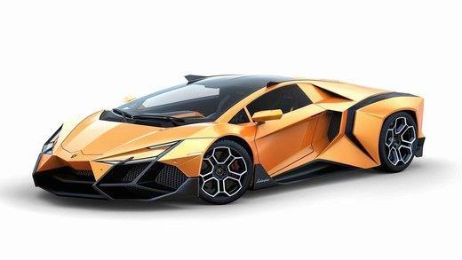
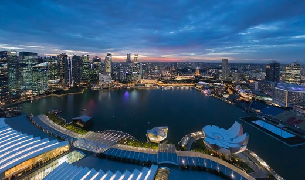
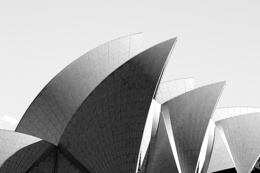

# LQIP CSS placeholders

`Image.Lqip.Css` encodes an LQIP image as a CSS value: a single 32-bit number,
packed into an RGBA hex code like `#a1b2c3d4`, that a static piece of CSS
expands into a blurred gradient placeholder.

The technique was created by Freek Zijlmans (documented in [this article](https://dev.to/frzi/image-placeholders-in-pure-css-or-defying-gods-with-math-and-color-3a5d)),
and the reference implementation lives at <https://github.com/frzi/lqip-css>.
Unlike `Image.Blurhash`, these placeholders are decoded entirely by the
browser's CSS engine.

## How it works

`Image.Lqip.Css.encode/1` resizes the image to a 3x3 thumbnail and samples three
pixels:

| Pixel        | CSS variable | Role                   |
| ------------ | ------------ | ---------------------- |
| top-left     | `--lqip-c0`  | background color       |
| center       | `--lqip-c1`  | first radial gradient  |
| bottom-right | `--lqip-c2`  | second radial gradient |

Each color is quantized ([adjusted for chroma](#chroma-aware-packing)),
and bit-packed into a single 32-bit value, which is rendered as an 8-digit
RGBA hex color, `#RRGGBBAA`:

```
|      RR       |      GG       |      BB       |      AA       |
|0 0 0 0 0 0 0 0|0 0 0 0 0 0 0 0|0 0 0 0 0 0 0 0|0 0 0 0 0 0 0 0|
|R R R R G G G G|B B B R R R R G|G G G B B B R R|R G G G G B B B|
|- - - - = = = = - - -|= = = = - - - - = = =|- - - = = = = - - -|
|       color 0       |       color 1       |      color 2      |
|       11-bit        |       11-bit        |      10-bit       |
```

## Generating the value

Compute the value once, and store it alongside the image:

```elixir
{:ok, image} = Image.open("photo.jpg")
{:ok, hex} = Image.Lqip.Css.encode(image)
#=> {:ok, "#a1b2c3d4"}
```

Then set a CSS variable on the element using inline styles:

```html

```

or as a data attribute, accessed by the stylesheet using the `attr()` function:

```html

```

Note that the browser support for `attr()` is still [not quite there](https://caniuse.com/css3-attr),
so for now, the CSS variable is the safest choice.

## The CSS

The stylesheet is identical for every image and only needs to be included once.
It unpacks the LQIP value into three colors (using
[relative color syntax](https://developer.mozilla.org/en-US/docs/Web/CSS/CSS_colors/Relative_colors))
and paints them as two radial gradients over the background color.

This CSS is a verbatim copy of the reference implementation's `lqip.css`:

```css
[data-lqip] {
  --lqip-c: attr(data-lqip type(<color>), white);
}

[style*="--lqip:"] {
  --lqip-c: var(--lqip);
}

[style*="--lqip:"],
[data-lqip] {
  /*
	 * |      RR       |      GG       |      BB       |      AA       |
	 * |0 0 0 0 0 0 0 0|0 0 0 0 0 0 0 0|0 0 0 0 0 0 0 0|0 0 0 0 0 0 0 0|
	 * |R R R R G G G G|B B B R R R R G|G G G B B B R R|R G G G G B B B|
	 * |- - - - = = = = - - -|= = = = - - - - = = =|- - - = = = = - - -|
	 * |       color 0       |       color 1       |      color 2      |
	 * |       11-bit        |       11-bit        |      10-bit       |
	 */
  --lqip-c0: color(
    from var(--lqip-c) srgb calc(round(down, r * 255 / pow(2, 4)) / 15)
      calc(mod(round(down, r * 255), pow(2, 4)) / 15)
      calc(round(down, g * 255 / pow(2, 5)) / 7) / 1
  );

  --lqip-c1: color(
    from var(--lqip-c) srgb calc(mod(round(down, g * 255 / 2), pow(2, 4)) / 15)
      calc(
        (
            (mod(round(down, g * 255), 2) * pow(2, 3)) +
              (round(down, b * 255 / pow(2, 5)))
          ) /
          15
      )
      calc(mod(round(down, b * 255 / pow(2, 2)), pow(2, 3)) / 7) / 1
  );

  --lqip-c2: color(
    from var(--lqip-c) srgb
      calc(
        (
            ((mod(round(down, b * 255), pow(2, 2)) * 2)) +
              round(down, alpha * 255 / pow(2, 7))
          ) /
          7
      )
      calc(mod(round(down, alpha * 255 / pow(2, 3)), pow(2, 4)) / 15)
      calc(mod(round(down, alpha * 255), pow(2, 3)) / 7) / 1
  );

  background:
    radial-gradient(
      150% 75% at 80% 100%,
      var(--lqip-c2),
      rgb(from var(--lqip-c2) r g b / 98%) 10%,
      rgb(from var(--lqip-c2) r g b / 92%) 20%,
      rgb(from var(--lqip-c2) r g b / 82%) 30%,
      rgb(from var(--lqip-c2) r g b / 68%) 40%,
      rgb(from var(--lqip-c2) r g b / 32%) 60%,
      rgb(from var(--lqip-c2) r g b / 18%) 70%,
      rgb(from var(--lqip-c2) r g b / 8%) 80%,
      rgb(from var(--lqip-c2) r g b / 2%) 90%,
      transparent
    ),
    radial-gradient(
      100% 75% at 40% 50%,
      var(--lqip-c1),
      rgb(from var(--lqip-c1) r g b / 98%) 10%,
      rgb(from var(--lqip-c1) r g b / 92%) 20%,
      rgb(from var(--lqip-c1) r g b / 82%) 30%,
      rgb(from var(--lqip-c1) r g b / 68%) 40%,
      rgb(from var(--lqip-c1) r g b / 32%) 60%,
      rgb(from var(--lqip-c1) r g b / 18%) 70%,
      rgb(from var(--lqip-c1) r g b / 8%) 80%,
      rgb(from var(--lqip-c1) r g b / 2%) 90%,
      transparent
    ),
    var(--lqip-c0);
}
```

## Chroma-aware packing

Because each channel is packed into only 3 or 4 bits, independent per-channel
rounding can give near-grey colors a visible tint. To reduce that, the encoder
chooses each color's packed value to be the one closest to the source in the
CIELAB space, measured with CIEDE2000 (via `Color.Distance.delta_e_2000/3`).

This keeps near-greys closer to neutral while still preserving chroma for
saturated colors.

## Examples

For each image, the original (left) and the LQIP placeholder it produces
(right).

<div style="display:grid;grid-template-columns:1fr 1fr;gap:16px 16px;max-width:620px">
  <figure style="margin:0">
    
    <figcaption style="margin-top:4px;font-size:.85em;color:#888">Kamchatka</figcaption>
  </figure>
  <figure style="margin:0">
    <div style="width:100%;aspect-ratio:520/282;border-radius:8px;background:radial-gradient(150% 75% at 80% 100%, rgb(146,102,73), rgba(146,102,73,0.98) 10%, rgba(146,102,73,0.92) 20%, rgba(146,102,73,0.82) 30%, rgba(146,102,73,0.68) 40%, rgba(146,102,73,0.32) 60%, rgba(146,102,73,0.18) 70%, rgba(146,102,73,0.08) 80%, rgba(146,102,73,0.02) 90%, transparent), radial-gradient(100% 75% at 40% 50%, rgb(119,102,73), rgba(119,102,73,0.98) 10%, rgba(119,102,73,0.92) 20%, rgba(119,102,73,0.82) 30%, rgba(119,102,73,0.68) 40%, rgba(119,102,73,0.32) 60%, rgba(119,102,73,0.18) 70%, rgba(119,102,73,0.08) 80%, rgba(119,102,73,0.02) 90%, transparent), rgb(187,204,219)"></div>
    <figcaption style="margin-top:4px;font-size:.85em;color:#888">Placeholder <code>#bcceca32</code></figcaption>
  </figure>

  <figure style="margin:0">
    
    <figcaption style="margin-top:4px;font-size:.85em;color:#888">Mongolia</figcaption>
  </figure>
  <figure style="margin:0">
    <div style="width:100%;aspect-ratio:520/357;border-radius:8px;background:radial-gradient(150% 75% at 80% 100%, rgb(146,136,109), rgba(146,136,109,0.98) 10%, rgba(146,136,109,0.92) 20%, rgba(146,136,109,0.82) 30%, rgba(146,136,109,0.68) 40%, rgba(146,136,109,0.32) 60%, rgba(146,136,109,0.18) 70%, rgba(146,136,109,0.08) 80%, rgba(146,136,109,0.02) 90%, transparent), radial-gradient(100% 75% at 40% 50%, rgb(153,170,182), rgba(153,170,182,0.98) 10%, rgba(153,170,182,0.92) 20%, rgba(153,170,182,0.82) 30%, rgba(153,170,182,0.68) 40%, rgba(153,170,182,0.32) 60%, rgba(153,170,182,0.18) 70%, rgba(153,170,182,0.08) 80%, rgba(153,170,182,0.02) 90%, transparent), rgb(153,187,219)"></div>
    <figcaption style="margin-top:4px;font-size:.85em;color:#888">Placeholder <code>#9bd35643</code></figcaption>
  </figure>

  <figure style="margin:0">
    
    <figcaption style="margin-top:4px;font-size:.85em;color:#888">Lamborghini</figcaption>
  </figure>
  <figure style="margin:0">
    <div style="width:100%;aspect-ratio:520/293;border-radius:8px;background:radial-gradient(150% 75% at 80% 100%, rgb(219,221,219), rgba(219,221,219,0.98) 10%, rgba(219,221,219,0.92) 20%, rgba(219,221,219,0.82) 30%, rgba(219,221,219,0.68) 40%, rgba(219,221,219,0.32) 60%, rgba(219,221,219,0.18) 70%, rgba(219,221,219,0.08) 80%, rgba(219,221,219,0.02) 90%, transparent), radial-gradient(100% 75% at 40% 50%, rgb(136,102,73), rgba(136,102,73,0.98) 10%, rgba(136,102,73,0.92) 20%, rgba(136,102,73,0.82) 30%, rgba(136,102,73,0.68) 40%, rgba(136,102,73,0.32) 60%, rgba(136,102,73,0.18) 70%, rgba(136,102,73,0.08) 80%, rgba(136,102,73,0.02) 90%, transparent), rgb(255,255,255)"></div>
    <figcaption style="margin-top:4px;font-size:.85em;color:#888">Placeholder <code>#fff0cb6e</code></figcaption>
  </figure>

  <figure style="margin:0">
    
    <figcaption style="margin-top:4px;font-size:.85em;color:#888">Singapore</figcaption>
  </figure>
  <figure style="margin:0">
    <div style="width:100%;aspect-ratio:520/307;border-radius:8px;background:radial-gradient(150% 75% at 80% 100%, rgb(0,51,73), rgba(0,51,73,0.98) 10%, rgba(0,51,73,0.92) 20%, rgba(0,51,73,0.82) 30%, rgba(0,51,73,0.68) 40%, rgba(0,51,73,0.32) 60%, rgba(0,51,73,0.18) 70%, rgba(0,51,73,0.08) 80%, rgba(0,51,73,0.02) 90%, transparent), radial-gradient(100% 75% at 40% 50%, rgb(68,68,73), rgba(68,68,73,0.98) 10%, rgba(68,68,73,0.92) 20%, rgba(68,68,73,0.82) 30%, rgba(68,68,73,0.68) 40%, rgba(68,68,73,0.32) 60%, rgba(68,68,73,0.18) 70%, rgba(68,68,73,0.08) 80%, rgba(68,68,73,0.02) 90%, transparent), rgb(51,102,146)"></div>
    <figcaption style="margin-top:4px;font-size:.85em;color:#888">Placeholder <code>#3688881a</code></figcaption>
  </figure>

  <figure style="margin:0">
    
    <figcaption style="margin-top:4px;font-size:.85em;color:#888">Hong Kong</figcaption>
  </figure>
  <figure style="margin:0">
    <div style="width:100%;aspect-ratio:520/292;border-radius:8px;background:radial-gradient(150% 75% at 80% 100%, rgb(36,51,73), rgba(36,51,73,0.98) 10%, rgba(36,51,73,0.92) 20%, rgba(36,51,73,0.82) 30%, rgba(36,51,73,0.68) 40%, rgba(36,51,73,0.32) 60%, rgba(36,51,73,0.18) 70%, rgba(36,51,73,0.08) 80%, rgba(36,51,73,0.02) 90%, transparent), radial-gradient(100% 75% at 40% 50%, rgb(85,102,109), rgba(85,102,109,0.98) 10%, rgba(85,102,109,0.92) 20%, rgba(85,102,109,0.82) 30%, rgba(85,102,109,0.68) 40%, rgba(85,102,109,0.32) 60%, rgba(85,102,109,0.18) 70%, rgba(85,102,109,0.08) 80%, rgba(85,102,109,0.02) 90%, transparent), rgb(85,119,146)"></div>
    <figcaption style="margin-top:4px;font-size:.85em;color:#888">Placeholder <code>#578acc9a</code></figcaption>
  </figure>

  <figure style="margin:0">
    
    <figcaption style="margin-top:4px;font-size:.85em;color:#888">Sydney Opera House (B&W)</figcaption>
  </figure>
  <figure style="margin:0">
    <div style="width:100%;aspect-ratio:520/346;border-radius:8px;background:radial-gradient(150% 75% at 80% 100%, rgb(146,153,146), rgba(146,153,146,0.98) 10%, rgba(146,153,146,0.92) 20%, rgba(146,153,146,0.82) 30%, rgba(146,153,146,0.68) 40%, rgba(146,153,146,0.32) 60%, rgba(146,153,146,0.18) 70%, rgba(146,153,146,0.08) 80%, rgba(146,153,146,0.02) 90%, transparent), radial-gradient(100% 75% at 40% 50%, rgb(102,102,109), rgba(102,102,109,0.98) 10%, rgba(102,102,109,0.92) 20%, rgba(102,102,109,0.82) 30%, rgba(102,102,109,0.68) 40%, rgba(102,102,109,0.32) 60%, rgba(102,102,109,0.18) 70%, rgba(102,102,109,0.08) 80%, rgba(102,102,109,0.02) 90%, transparent), rgb(221,221,219)"></div>
    <figcaption style="margin-top:4px;font-size:.85em;color:#888">Placeholder <code>#ddccce4c</code></figcaption>
  </figure>
</div>
